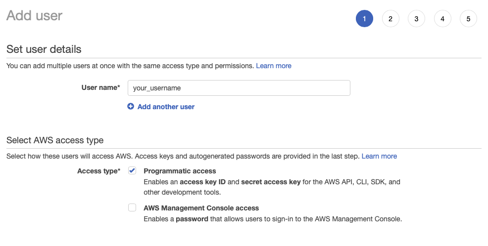
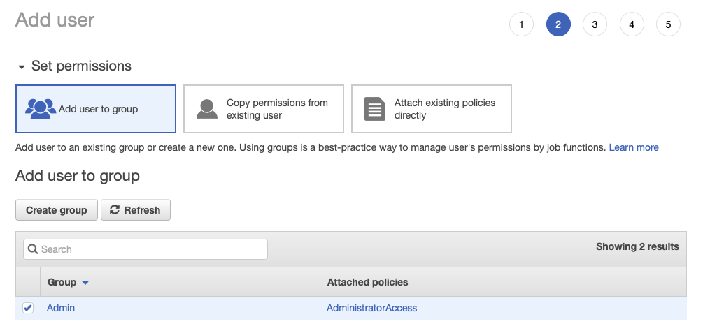
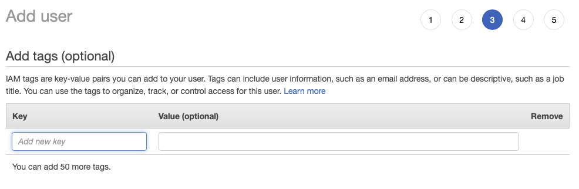
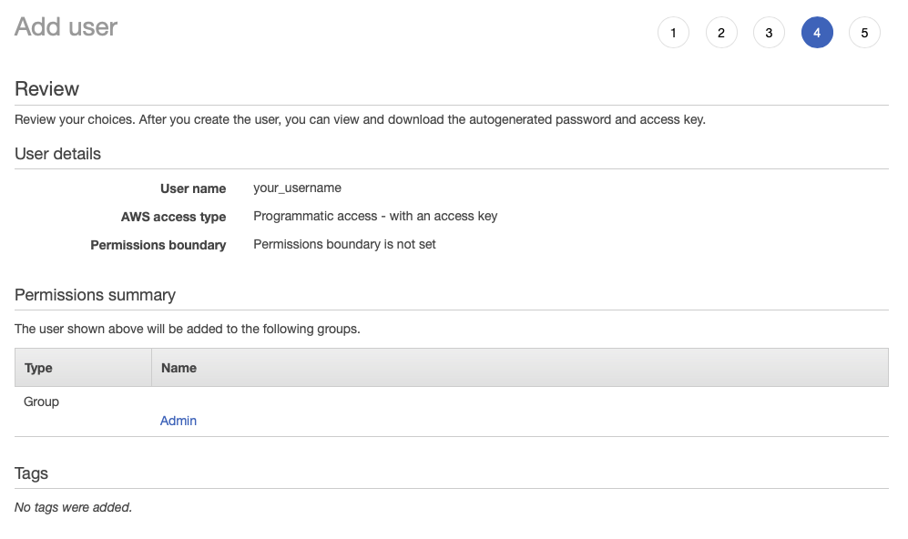
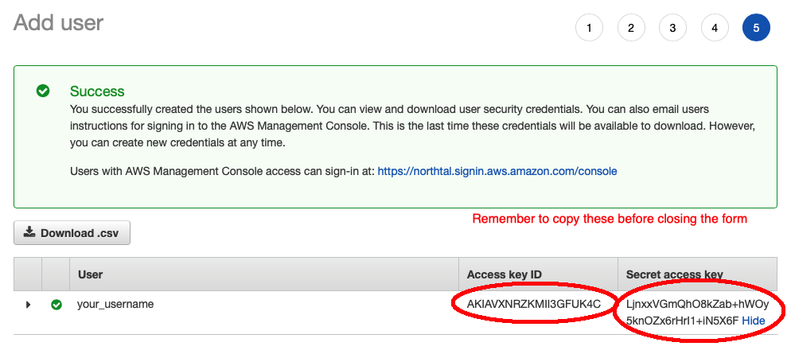

# Set up AWS IAM user for programmatic access
* Sign in to your AWS account (normally with Root account or another IAM with Web console access if you already have one)
* Navigate to [Identity and Access Management dashboard](https://console.aws.amazon.com/iam/home#/users)
* Follow the instructions in these screenshots to create an IAM user for this tech talk. Note that you need to copy the `Access key ID` and `Secret access key` for later usage.

1. Step 1: 
2. Step 2: 
3. Step 3: 
4. Step 4: 
5. Step 5: 
